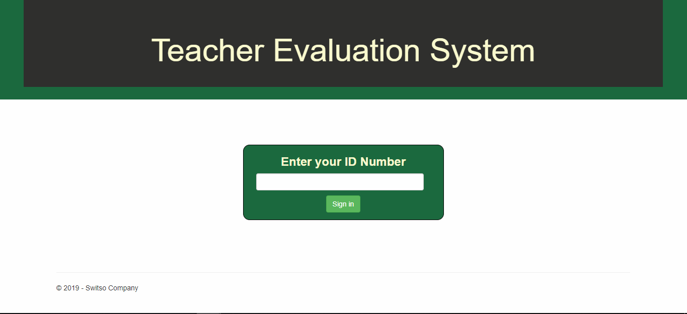
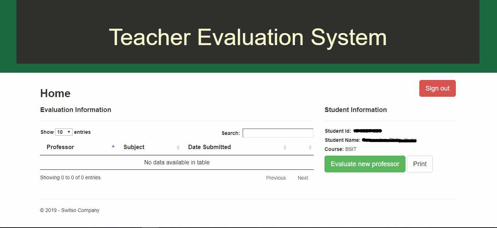
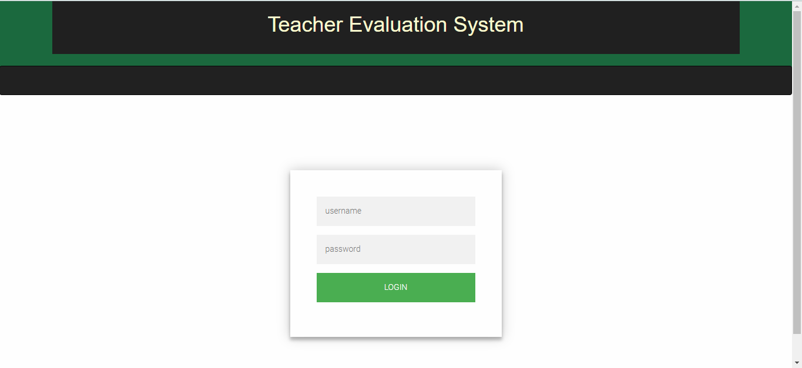
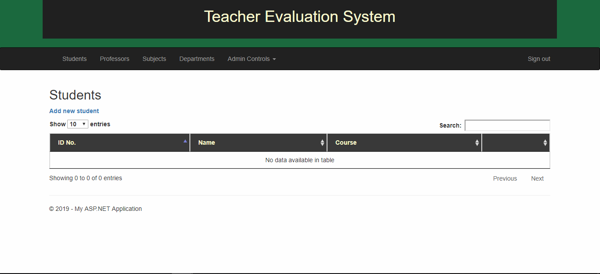

# TeacherEvaluationSystem

  

<b>Teacher Evaluation System</b>

&nbsp;&nbsp;&nbsp;&nbsp;&nbsp;Teacher Evaluation System helps lessen the hassle in evaluating the teachers or professors by their students. This will also help the admins in calculating the total evaluation of each teacher because it has a function that tally its total evaluation. This serves as an helping tool the school to lessen their problems and faster tallying of results.
  

<h1>Student</h1>
<h3>Student Login</h3>

  

<h3>Home</h3>

  

<h3>Evaluation</h3>

  

<h1>Admin</h1>
<h3>Admin Login</h3>

  

<h3>Admin Home</h3>

  

